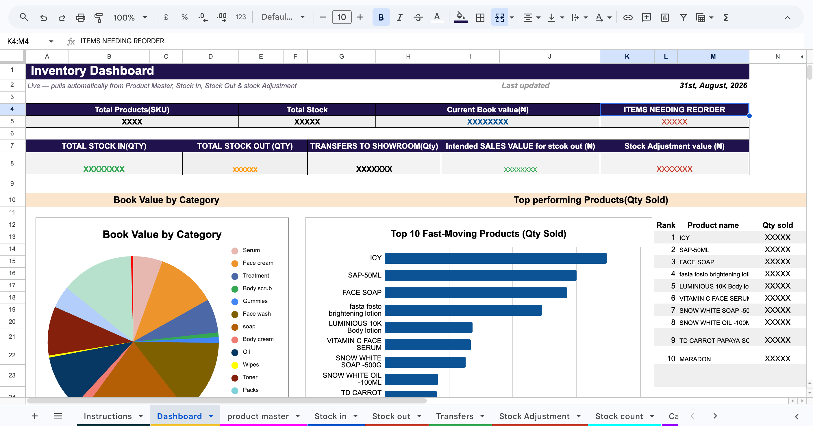

# Inventory Management & Analytics Dashboard

## Project Overview

An Excel-based inventory management and analytics system designed to
monitor stock levels, stock movements, inventory value, reorder
requirements, and physical stock variances across multiple warehouse
locations.

## Dashboard Preview

The project combines structured inventory records with automated
calculations and a management dashboard to turn operational inventory
data into actionable business information.

## Business Problem

Managing inventory across multiple locations can make it difficult to
maintain accurate stock records, identify low-stock products, reconcile
physical counts with system quantities, and understand which products
are driving inventory value and movement.

The objective of this project was to create a centralised Excel system
that connects inventory transactions to a live reporting dashboard.

## Objectives

-   Track inventory across three warehouse locations.
-   Maintain a centralized product/SKU master list.
-   Record stock receipts and stock-outs.
-   Track transfers between locations.
-   Record stock adjustments such as losses, breakages, usage, and other
    issues.
-   Calculate current stock automatically.
-   Calculate inventory book value.
-   Identify products requiring reorder.
-   Compare physical stock counts with system quantities.
-   Highlight stock shortages, surpluses, and negative inventory.
-   Provide management with a concise dashboard for decision-making.

## Tools & Skills

**Tools** - Microsoft Excel - Excel formulas - Data validation/drop-down
lists - Conditional formatting - Dashboard design

**Analytical skills** - Data cleaning and structuring - Inventory
analysis - KPI development - Stock reconciliation - Exception/variance
analysis - Business reporting - Data visualization

**Excel functions used** - `SUMIFS` - `SUMIF` - `VLOOKUP` - `IF` -
`IFERROR` - `SUMPRODUCT` - `LARGE` - `COUNTIF` - `COUNTA` - `EOMONTH` -
`TODAY` - Text functions such as `LEFT`, `UPPER`, and `TEXT`

## Data Structure

The workbook is organized into operational input sheets, reference data,
calculations, and reporting.

  -----------------------------------------------------------------------
  Sheet                               Purpose
  ----------------------------------- -----------------------------------
  **Product Master**                  Central product/SKU information,
                                      unit cost, supplier and reorder
                                      levels

  **Stock In**                        Records inventory received into the
                                      business

  **Stock Out**                       Records products issued/sold from
                                      inventory

  **Transfers**                       Tracks inventory movement between
                                      warehouse locations

  **Stock Adjustment**                Records inventory changes such as
                                      losses, breakages, usage and gifts

  **Stock Count**                     Compares system quantity with
                                      physical count and calculates
                                      variance

  **Cal**                             Supporting calculations used by the
                                      reporting layer

  **Dashboard**                       Management-facing inventory KPIs
                                      and visual analysis

  **Instructions**                    User guide for operating the
                                      inventory system

  **List**                            Reference/drop-down values used for
                                      data consistency
  -----------------------------------------------------------------------

## Dashboard KPIs

The dashboard provides a high-level view of:

-   Total number of SKUs
-   Total inventory quantity
-   Current inventory book value
-   Number of products requiring reorder
-   Total stock received
-   Total stock issued
-   Transfers to showroom
-   Intended sales value of stock-out transactions
-   Stock adjustment value
-   Top-performing products by quantity sold
-   Top products by inventory value
-   Monthly stock-in versus stock-out activity
-   Inventory units by warehouse
-   Low-stock/reorder priorities

## Snapshot of the Dataset

At the August 2026 reporting point, the dashboard showed:

  KPI                                       Value
  -------------------------------- --------------
  Products/SKUs                                81
  Total stock units                        XXXXX
  Inventory book value               ₦XXXXXXX
  Products needing reorder                     20
  Total stock in                      XXXXX
  Total stock out                     XXXXX
  Transfers to showroom               XXXXX
  Intended stock-out sales value      XXXXX
  Stock adjustment value                 XXXX

## Key Insights

### 1. Inventory is concentrated in a small number of high-value products

The ten highest-value products account for a substantial portion of the
inventory book value. The largest individual inventory values in the
dataset include:

-   Mocha Face Scrub --- ₦XXXX
-   DRENCHED IN GOLD --- ₦XXXX
-   AGELESS Anti-Aging Face Cream --- ₦XXXX
-   RICE GLOW TONER --- ₦XXXXX

This indicates that inventory management should prioritize not only
quantity but also the financial value tied up in each SKU.

### 2. Reorder risk requires attention

20 products were flagged for reorder.

The highest-priority exceptions included:

-   fasta fosto brightening lotion --- current stock of -21 against a
    reorder level of 36
-   FACE SOAP --- 43 units against a reorder level of 100
-   UGLOW --- 44 units against a reorder level of 96
-   ROSA LIP SET --- 17 units against a reorder level of 42

Negative stock balances are particularly important because they can
indicate timing issues, missing transactions, unrecorded transfers, or
stock-control problems that should be investigated.

### 3. Fast-moving products are not necessarily the highest-value products

The leading products by quantity sold were:

1.  ICY --- 347 units
2.  SAP-50ML --- 300 units
3.  FACE SOAP --- 286 units
4.  fasta fosto brightening lotion --- 246 units
5.  LUMINIOUS 10K Body lotion --- 137 units

This demonstrates why inventory decisions should consider both
**movement** and **inventory value** rather than relying on a single
metric.

### 4. Physical stock reconciliation is built into the system

The Stock Count sheet compares system quantity against physical quantity
and automatically calculates:

**Variance = Physical Quantity − System Quantity**

It then classifies the result as:

-   Match
-   Shortage
-   Surplus
-   Pending Count

This creates an audit trail for identifying discrepancies between
recorded and actual inventory.

## Inventory Calculation Logic

The system calculates current inventory by combining opening balances
with transaction activity.

Conceptually:

**Current Stock = Opening Stock + Stock In + Transfers In − Stock Out −
Transfers Out − Stock Adjustments**

Inventory book value is then calculated as:

**Book Value = Current Stock × Unit Cost**

This allows the dashboard to update as inventory transactions change.

## Business Recommendations

Based on the analysis, the following actions are recommended:

1.  **Investigate negative stock balances immediately.** Negative
    quantities should be traced back to stock-out entries, transfers,
    and adjustments.
2.  **Prioritize high-value inventory.** Products with large book values
    should receive stronger monitoring because errors can have a larger
    financial impact.
3.  **Separate fast-moving from high-value products.** Reorder planning
    should consider sales velocity as well as stock value.
4.  **Perform regular physical counts.** High-value and fast-moving SKUs
    should be counted more frequently.
5.  **Standardize transaction entry.** Consistent SKU, warehouse, and
    adjustment selections reduce reporting errors.
6.  **Review reorder levels periodically.** Reorder points should
    reflect actual demand and operational lead times rather than remain
    static.
7.  **Monitor transfers separately from sales.** This prevents warehouse
    movement from being mistaken for customer demand.

## Project Impact

The system demonstrates how Excel can be used to move from manual
inventory records to a structured analytics workflow:

**Raw transactions → Structured data → Automated calculations →
Exception detection → KPI dashboard → Business decisions**

The project provides a single reporting layer for inventory visibility
while reducing the need to manually calculate stock balances and
identify low-stock products.

## Screenshots

Add screenshots of the following before publishing the repository:

### Dashboard

`/screenshots/dashboard.png`

### Stock Reconciliation

`/screenshots/stock-count.png`

### Product/Inventory Analysis

`/screenshots/product-master.png`

## How to Use

1.  Open the Excel workbook.
2.  Review the **Instructions** sheet.
3.  Maintain the **Product Master** with approved product and reorder
    information.
4.  Enter new receipts in **Stock In**.
5.  Enter sales/issues in **Stock Out**.
6.  Record warehouse movements in **Transfers**.
7.  Record losses, usage, gifts, or other adjustments in **Stock
    Adjustment**.
8.  Perform physical counts in **Stock Count**.
9.  Review the **Dashboard** for inventory KPIs and exceptions.

## Portfolio Skills Demonstrated

This project demonstrates practical experience in:

-   Excel dashboard development
-   Inventory analytics
-   Data validation
-   Data reconciliation
-   KPI reporting
-   Business intelligence
-   Operational reporting
-   Exception analysis
-   Spreadsheet automation
-   Business decision support

## Author

**Funke Bolarin**

Data Analytics \| Inventory Management \| Supply Chain
