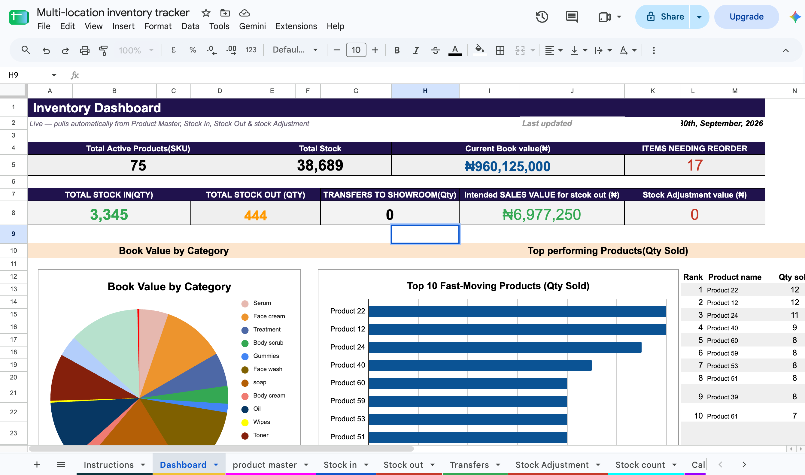
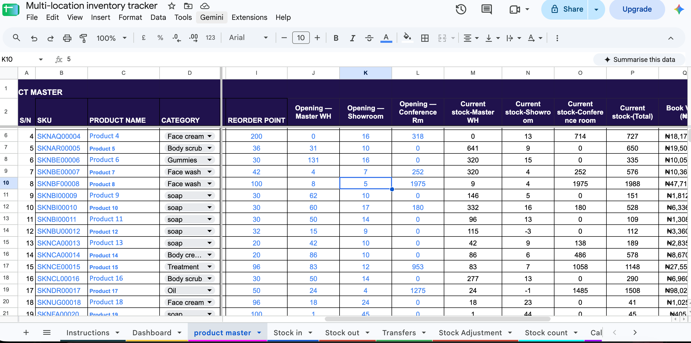
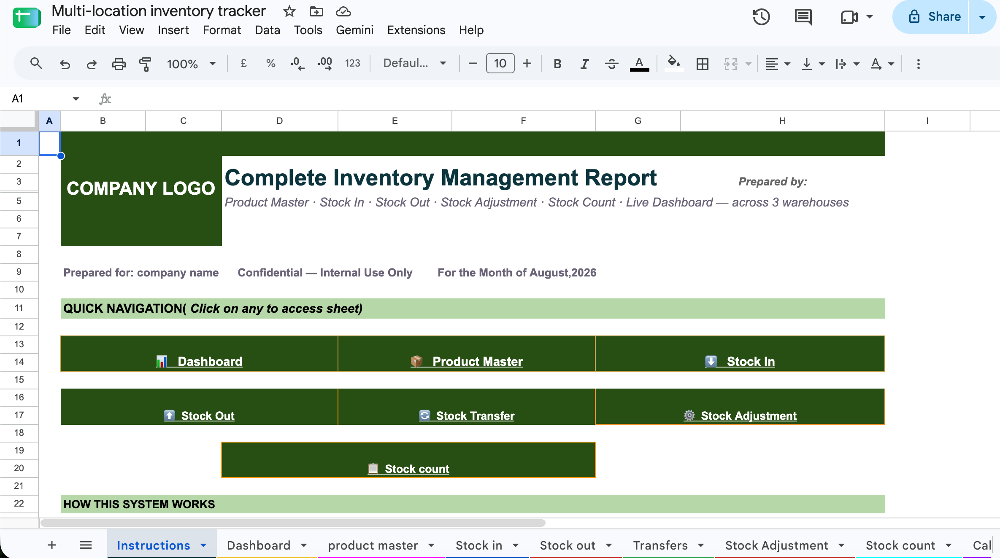

# Inventory Management Dashboard
> A multi-location inventory control report focused on stock movements(in/out, Transfers) and tracking across warehouses, inventory valuation, ABC classification, and identifying out of stock products.

---

## Project Overview

An Excel-based inventory management system designed to
monitor stock levels, stock movements, inventory value, reorder
requirements, and physical stock variances across multiple warehouse
locations.

The analysis covered **81 SKUs with a total inventory value of approximately ₦769 million**.
---
## Project Objective
The main objectives were to:

-   Track inventory across three warehouse locations.
-   Maintain a centralized product/SKU master list.
-   Record stock receipts and stock-outs.
-   Track transfers between locations.
-   Record stock adjustments such as losses, breakages, usage, and other
    issues.
-   Calculate current stock automatically.
-   Calculate inventory book value.
-   Identify products requiring reorder.
-   Compare physical stock counts with system quantities.
-   Highlight stock shortages, surpluses, and negative inventory.
-   Provide management with a concise dashboard for decision-making.
---

Inventory Dashboard

The dashboard summarized key inventory information in a management-friendly format.

It provided visibility into:

- Inventory value
- Units in stock
- Stock movement (IN/OUT,Transfers)
- Top selling products
- Stock shortages
- Inventory position

## Tools Used
- Microsoft Excel
- Google Sheets

### Skills Demonstrated

- Inventory Control
- Stock Reconciliation
- Physical Stock Counting
- Inventory Valuation
- ABC Classification
- Multi-Location Inventory Management
- Stock Level Analysis
- Inventory Reporting

---
## Project Scope

| Metric | Result |
|---|---:|
| SKUs Reviewed | **81** |
| Total Inventory Value | **₦769M** |
| Locations | **Multiple** |
| Analysis Period | **July 2026** |
| Classification | **ABC Analysis** |

---
# Inventory Workbook

The inventory workbook was structured to support stock tracking, reconciliation, valuation, and analysis.

---

## Workbook Structure & Functions
| Sheet | Main Function | What It Does |
|---|---|---|
| **Product Master** | Product database | Stores SKU, product name, category, cost price, selling price, supplier, reorder level, current stock, stock value and status. |
| **Stock Movement** | Stock In / Stock Out | Records incoming and outgoing inventory transactions and provides a history of stock movement. |
| **Transfers** | Location-to-location movement | Tracks products transferred between locations, including warehouse and showroom movements. |
| **Stock Adjustments** | Inventory adjustments | Records SPA, MD's use, gifts, digital media, product exchanges, damaged products and variance adjustments. |
| **Damages** | Damaged stock tracking | Records damaged or unusable products and the quantity/value lost. |
| **Stock Count** | Physical inventory reconciliation | Records physical counts and compares counted quantities with system/book quantities to identify variances. |
| **Inventory Valuation** | Stock value calculation | Calculates the value of inventory based on available quantities and product cost prices. |
| **Stock Level Analysis** | Stock monitoring | Identifies products that are overstocked, understocked or within expected stock levels. |
| **Dashboard** | Management reporting | Summarises inventory units, book value, stock movement, top-value products, shortfalls and other key inventory indicators. |

---
# Key Findings

The inventory management report review provided the following insights:

- **81 SKUs** were reviewed.
- The reviewed inventory represented approximately **₦769 million** in inventory value.
- ABC classification was used to prioritize inventory based on value.
- Under-stocked products were identified for further review.
- Multi-location analysis provided visibility into stock distribution.
- Physical stock counting supported inventory reconciliation.

---
# 💡 Business Value

The Project provided a structured approach to monitoring and reporting inventory across multiple locations.

It supported:

- Better inventory visibility
- More structured stock reconciliation
- Identification of high-value products
- Identification of stock-level concerns
- Improved inventory reporting
- More informed replenishment and inventory-control decisions

---
# 📑 Project Deliverables

## Inventory Workbook

The workbook brought together:

- Product Master
- Stock Movement
- Transfers
- Stock Adjustments
- Physical Stock Count
- Inventory Valuation
- ABC Classification
- Inventory Dashboard

### Workbook Overview/Instructions

---
# 🔗 Related Work

**Portfolio:**  
[View Portfolio]( https://funke-b.github.io/Funke-Val-B.github.io/)
---

# Author

**Oluwafunke Bolarin**

Inventory Control & Reporting  
Excel | Google Sheets | Inventory Management | Stock Reconciliation | ABC Classification | Multi-Location Inventory
